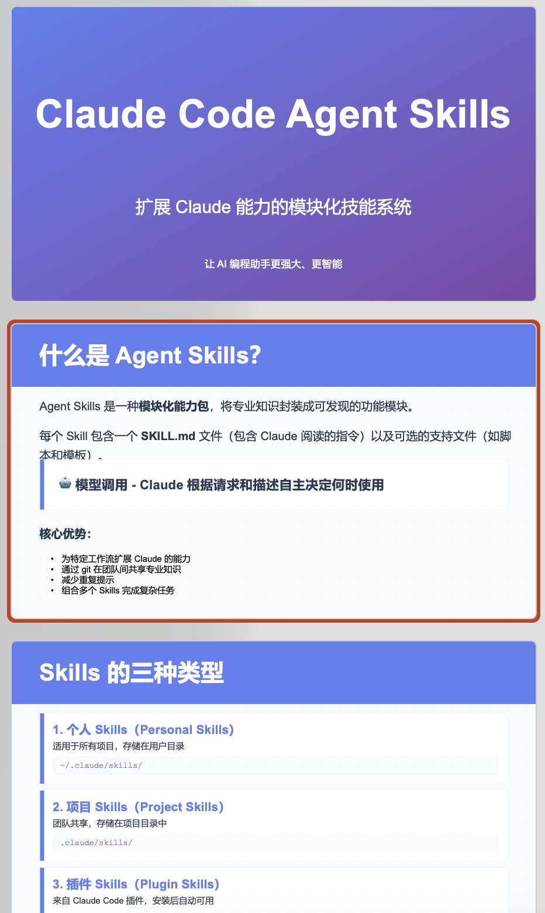
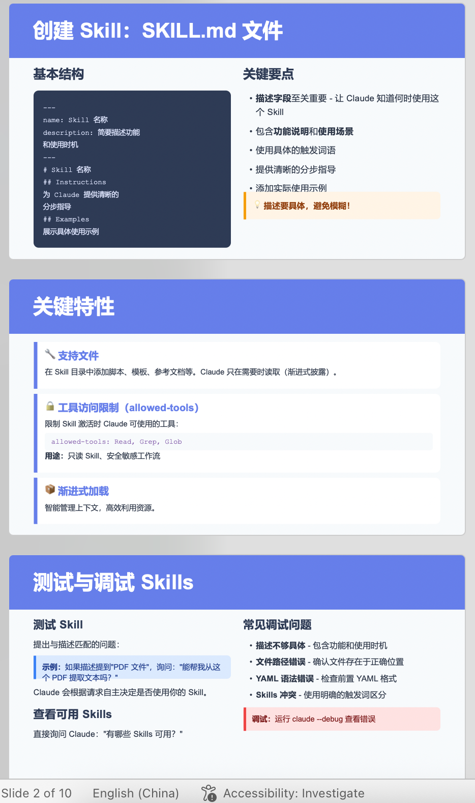

# Strands Agents SDK 如何使用 [Claude SKILLs](https://github.com/anthropics/skills)

## 环境要求
1. Python >=3.12
2. uv https://docs.astral.sh/uv/getting-started/installation/
3. nodejs https://nodejs.org/en/download
4. OpenAI 兼容协议

## 快速开始

### 1. 安装依赖
```bash
# 安装 Python 依赖
uv sync

# 安装 Node.js 依赖（可选，Agent 会自动安装）
npm install
```

### 2. 配置模型网关

编辑 `.env` 文件，配置模型网关：

```bash
# 必填：模型网关地址
LLM_BASE_URL=http://your-company-gateway.com/v1

# 必填：API Key
LLM_API_KEY=your-api-key-here

# 必填：主模型 ID
LLM_MODEL_ID=gpt-5

# 可选：摘要模型 ID
LLM_SUMMARY_MODEL_ID=gpt-5-mini

# 可选：Tavily API（用于网络搜索）
TAVILY_API_KEY=your-tavily-api-key
```

**详细配置指南：** 参考 [GATEWAY_CONFIG.md](GATEWAY_CONFIG.md)

### 3. 测试配置

运行测试脚本验证网关配置：

```bash
uv run python test_gateway.py
```

如果测试通过，会看到：
```
🎉 所有测试通过！配置正确，可以运行 main.py
```

## 使用示例

### 示例 1：生成 PPT

```bash
uv run python main.py --prompt "research about Claude Code Agent Skills (https://docs.claude.com/en/docs/claude-code/skills), and create a ppt in Chinese to introduce it, save it as pptx file in working directory."
```

### 示例 2：简单对话

```bash
uv run python main.py --prompt "你好，请介绍一下你可以做什么"
```

### 示例 3：数据分析

```bash
uv run python main.py --prompt "帮我分析一下销售数据，创建一个 Excel 报表"
```

## 效果预览

**生成的 PPT 文件：** [Claude-Code-Agent-Skills-介绍.pptx](assets/Claude-Code-Agent-Skills-介绍.pptx)




## 可用技能 (Skills)

项目集成了以下 Claude Skills：

- **pptx** - 创建和编辑 PowerPoint 演示文稿
- **docx** - Word 文档处理
- **xlsx** - Excel 电子表格操作
- **pdf** - PDF 文档处理
- **canvas-design** - 创建视觉设计和海报
- **algorithmic-art** - 生成算法艺术
- **theme-factory** - 主题样式工具
- 更多技能请查看 `skills/` 目录

## 配置文件说明

- `.env` - 环境变量配置（网关地址、API Key 等）